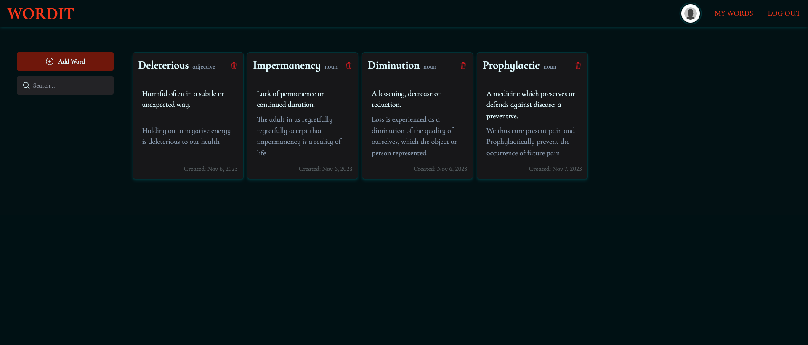

  <h1 align="center">Wordit</h1>

  

		<h3>
			<a href="https://wordit-vocab.netlify.app/">
				Demo
			</a>
			 | 
			<a href="https://github.com/GloBoiVic/Wordit">
				Github Repo
			</a>
		</h3>
	

A custom vocabulary word tracker app built on top of Nodejs, Express for the backend, React on the frontend, MongoDB for the database, and Vite as the bundler

## Tech Stack

- [Nodejs](https://nodejs.org/en) - JavaScript runtime environment.
- [Expressjs](https://expressjs.com/) - Fast, unopinionated, minimalist web framework for Node.js.
- [MongoDB](https://www.mongodb.com/) - A cross-platform document-oriented database program.
- [React](https://es.reactjs.org/) - Front-End JavaScript library.
- [Tailwind CSS](https://tailwindcss.com/) - A utility-first CSS framework.
- [NextUI](https://nextui.org/) - Beautiful, fast and modern React UI Library.
- [React Query](https://tanstack.com/query/latest) - A Powerful asynchronous state management for React.
- [React Hot Toast](https://react-hot-toast.com/) - Toast notifications for React.
- [Vite](https://vitejs.dev/) - Frontend Bundler

## Features

## Getting Started

## Future Features

## Contact

- [LinkedIn](https://www.linkedin.com/in/developing-vic/) - please reach out to me! I want to connect with other developers!
